# Guide Complet Linux Mint pour Multimédia et Gaming

Bienvenue dans ce guide détaillé pour configurer Linux Mint, pour le multimédia et le gaming. Voici une approche étape par étape pour tirer le meilleur parti de votre système.

<br>

## Table des Matières

1. [Installation et Configuration Initiale](#1-installation-et-configuration-initiale)
2. [Installation des Pilotes Nvidia](#2-installation-des-pilotes-nvidia)
3. [Mise à Jour du Système et Choix des Miroirs](#3-mise-à-jour-du-système-et-choix-des-miroirs)
4. [Modification du Paramètre vm.max_map_count](#4-modification-du-paramètre-vm-max_map_count)
5. [Installation de Logiciels pour Gaming](#5-installation-de-logiciels-pour-gaming)
6. [Optimisation des Performances de Jeu](#6-optimisation-des-performances-de-jeu)
7. [Guides divers](#7-guides-divers)
8. [Dépannage et Conseils](#8-dépannage-et-conseils)

<br>

## 1. Installation et Configuration Initiale

L'installation de Linux Mint est la première étape vers une configuration optimisée pour le multimédia et le gaming. Nous avons préparé un tutoriel vidéo qui guide à travers les étapes d'installation, y compris la création d'une clé bootable sous Windows.

**Vidéos montrant l'installation et la configuration :** 

- [Installer & Configurer Linux Mint à 100% pour du Gaming (avec AMD) par Vinceff](https://www.youtube.com/watch?v=embv0s3_C8c)
- [Linux Mint Gaming Nvidia Challenge / Tuto par Cardiac](https://www.youtube.com/watch?v=D0YQ11hwBXQ)

<br>

## 2. Installation des Pilotes Nvidia

L'installation des pilotes Nvidia est essentielle pour garantir une performance optimale dans vos jeux et applications.


- **Lancement du gestionnaire de pilotes**

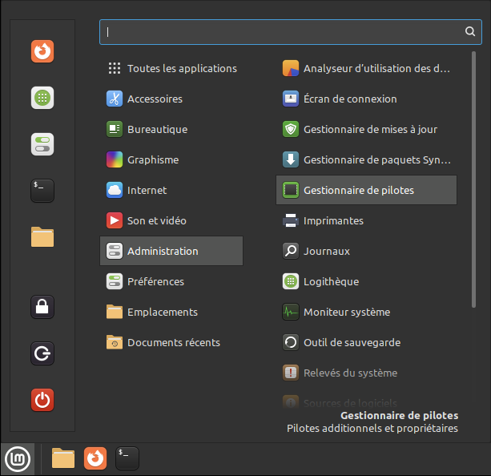


- **Recherche des pilotes sur votre machine**

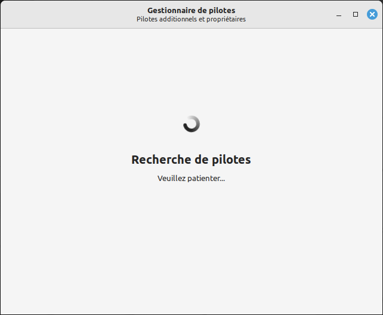


- **Liste des pilotes trouvés par le gestionnaire**
  
_Le pilote nouveau est sélectionné par défaut._

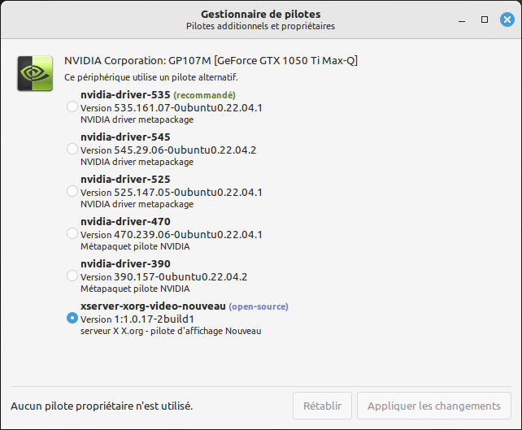

- **Sélectionnez la version du pilote désirée**

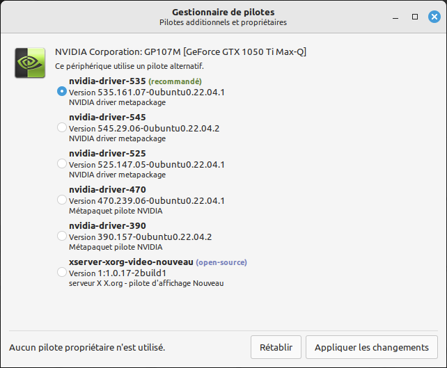

- **Le gestionnaire procède à l'installation et vous invite à redémarrer.**

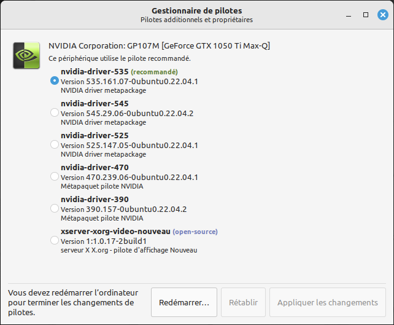

- **Aucun driver n'est proposé pour ma carte Nvidia**

Il peut arriver qu'aucun driver soit proposé pour une carte Nvidia, notamment si la carte est récente. Dans ce cas, c'est souvent un problème lié à la reconnaissance de celle-ci, ce qui fait que même si le driver est potentiellement existant, rien n'est proposé en dehors du driver de base `nouveau`. Exemple ci-dessous avec une carte RTX 4070 SUPER :

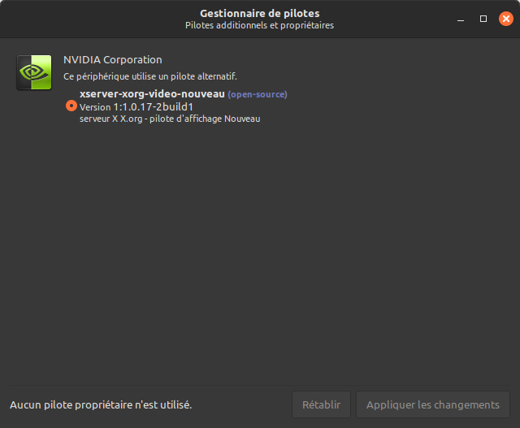

Il est alors possible de se rendre ici pour voir les drivers installables pour notre carte graphique : https://www.nvidia.com/fr-fr/geforce/drivers/

Le 550 et 535 sont les possibilités proposées. Pour voir les drivers existants sous Mint, taper cette commande dans un terminal : `apt search nvidia-driver`

Il faut alors regarder les résultats du type `nvidia-driver-535` tout court. Pour le cas ici, Mint propose uniquement le driver 535 et il faudra donc ouvrir un terminal et taper : `sudo apt install nvidia-driver-535`

Et une fois le driver installé, il suffit de redémarrer.

<br>

## 3. Mise à Jour du Système et Choix des Miroirs

Après l'installation, la première étape consiste à mettre à jour votre système. L'outil de mise à jour, symbolisé par un bouclier dans la barre des tâches, vous guide à travers ce processus.

- **Outil de mise à jour**:


- **Choix d'un miroir local**:


- **Sources de logiciels**:

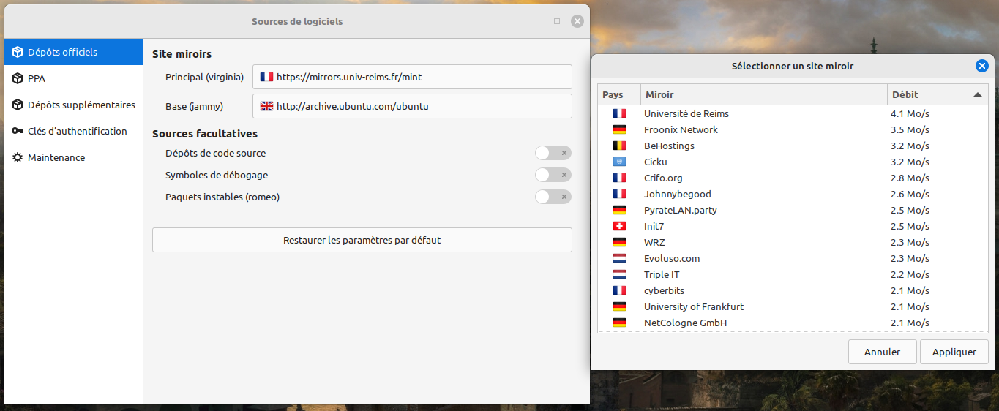

- **Mise à jour effectuée**:


- **Mise à niveau (changement de version)**:

Voir [page suivante](upgrade.md).

<br>

## 4. Modification du Paramètre vm.max_map_count

Pour optimiser la compatibilité et les performances des jeux, sur les versions de Linux Mint antérieures à la 22, il est conseillé d'augmenter la valeur de `vm.max_map_count`.

Dans un terminal, exécutez :

```sh
echo 'vm.max_map_count=1048576' | sudo tee -a /etc/sysctl.conf
```

Cette modification permet d'améliorer la gestion des ressources pour les jeux nécessitant un grand nombre de mappages de fichiers virtuels, essentiel pour une expérience de jeu fluide et sans interruption.

--- 

<br>

## 5. Installation de Logiciels pour Gaming

La logithèque de Linux Mint offre un accès à de nombreuses applications essentielles pour le gaming, comme Steam.

- **Accès à la logithèque**:

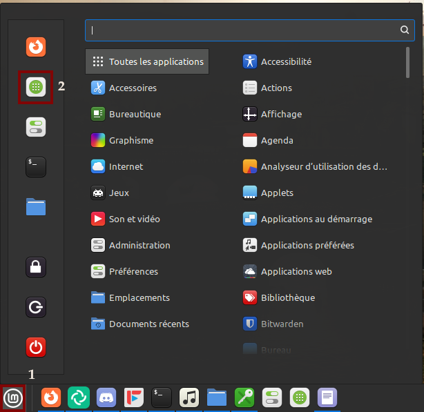

- **Page d'accueil de la logithèque**:

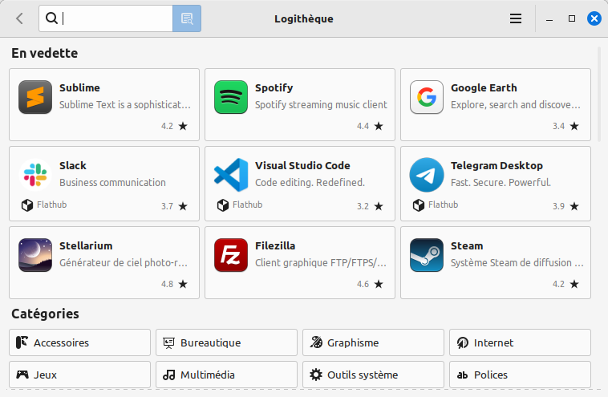

- **Recherche de Steam**:

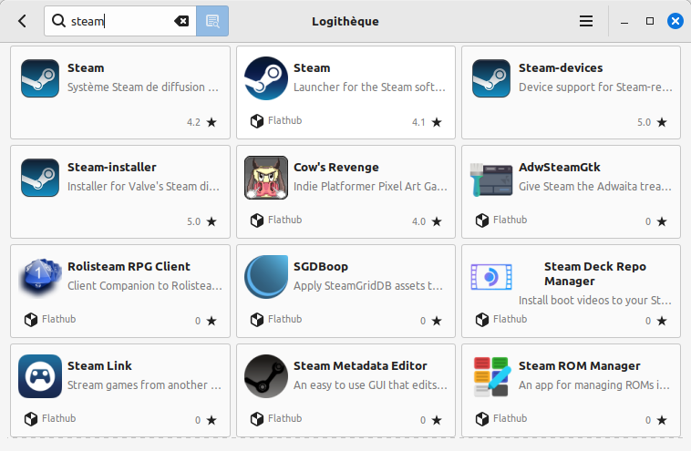

Lors de l'installation de logiciels pour le gaming sur Linux Mint via la logithèque, vous rencontrerez souvent deux types de paquets pour une même application : les paquets système et les Flatpak. 

Voici une explication concise pour vous aider à choisir le plus adapté à vos besoins :

- **Paquets système** : Directement issus des dépôts officiels de la distribution, ils sont intégrés au système et peuvent ne plus être à jour. Pour certaines applications comme Steam, qui se mettent à jour indépendamment, cela ne pose pas de problème. Ces paquets utilisent les librairies déjà installées sur votre système.
  
- **Paquets Flatpak** : Ces paquets sont conteneurisés et s'exécutent dans leur propre environnement, incluant toutes leurs dépendances. Ils offrent généralement les versions les plus récentes des applications et garantissent une compatibilité trans-distribution. Les Flatpaks sont particulièrement utiles pour des logiciels nécessitant la dernière version de Mesa, comme c'est souvent le cas pour les utilisateurs de cartes graphiques Intel ou AMD. Cependant, leur isolement du système peut compliquer l'accès à certains périphériques, comme les disques durs secondaires.

Pour les applications critiques pour le gaming telles que **Heroic Games Launcher** (pour l’Epic Games Store, GOG, ou Amazon Prime Gaming) et **Lutris** (pour Battle.net, Ubisoft Connect, EA App, etc.), le format Flatpak est souvent préféré sur les distributions stables car il assure la disponibilité de la dernière version, alors que le paquet système peut ne pas être à jour, voir obsolète.

Chaque choix a ses avantages et inconvénients, et le meilleur dépend de vos besoins spécifiques en matière de gaming sur Linux.

[**Guide STEAM** sur Linux](https://codeberg.org/Gaming-Linux-FR/steam-post-install#readme).

--- 

<br>

## 6. Optimisation des Performances de Jeu

Pour améliorer les performances en jeu, il est conseillé de désactiver la composition des fenêtres pour les applications en plein écran.

- **Désactivation de la composition**:

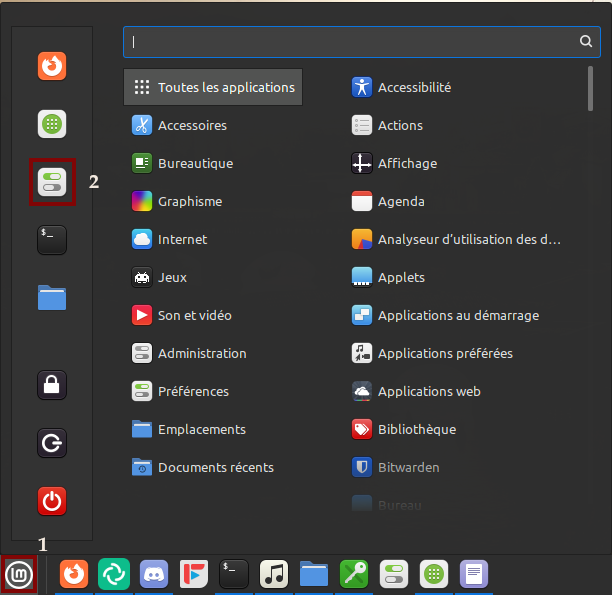, 

Allez dans Général :

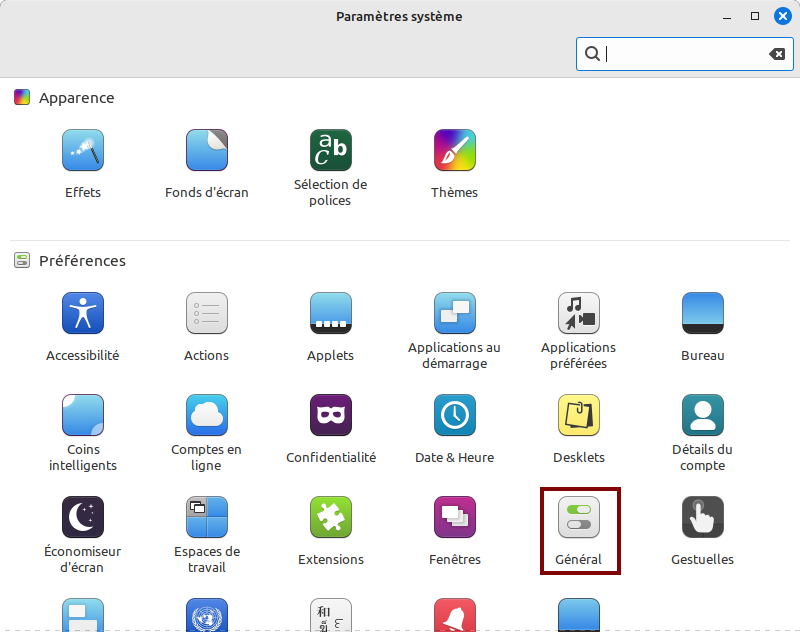,

Cochez l'option "Désactiver la composition pour les fenêtres en plien écran"

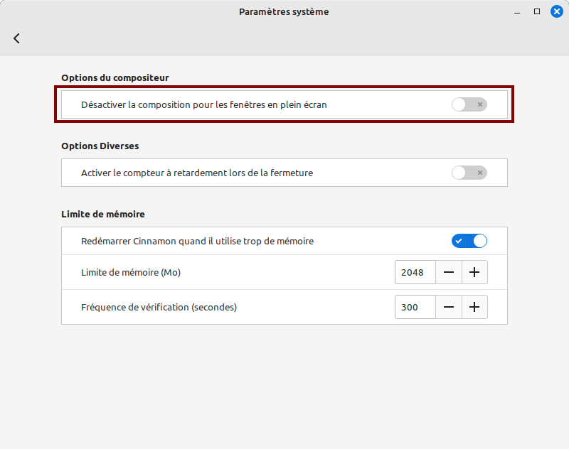

<br>

## 7. Guides divers

- **[Formater et monter un disque](/Gaming-Linux-FR/guide-formater-monter)** : Formater et monter au démarrage ses disques / SSD internes sur Linux
- **[Astuces](/Gaming-Linux-FR/glf-astuces)** : Astuces diverses, ne concernant pas une distribution spécifique.


## 8. Dépannage et Conseils

Ce guide vise à offrir une introduction complète à l'utilisation de Linux Mint pour le gaming et le multimédia. Pour des problèmes spécifiques, n'hésitez pas à rejoindre notre discord : 

[](https://discord.gg/WCAKxxRA3t)

Ce guide est destiné à être régulièrement mis à jour. Vos retours et contributions sont les bienvenus pour aider à enrichir cette ressource et assister d'autres utilisateurs dans leur expérience Linux Mint.
