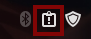
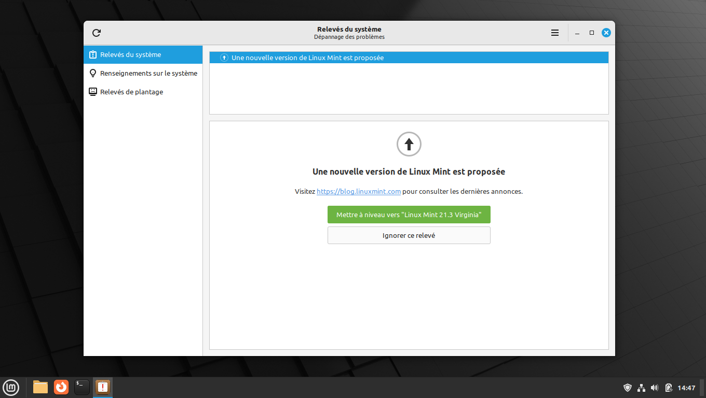
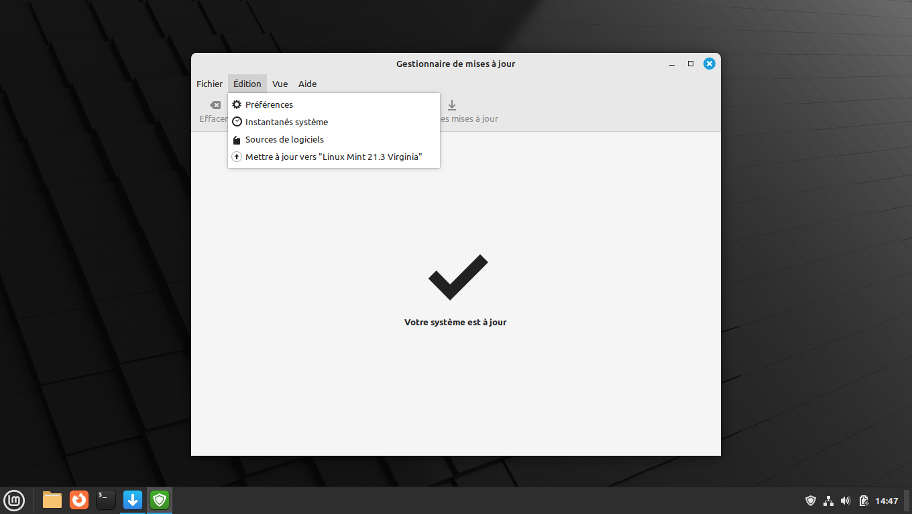
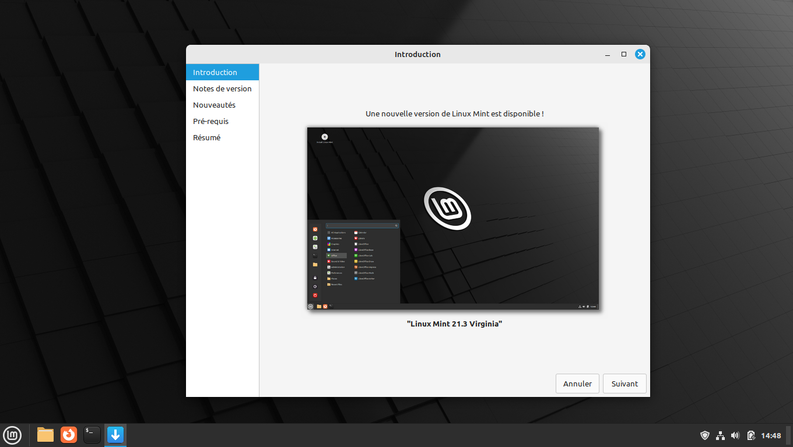
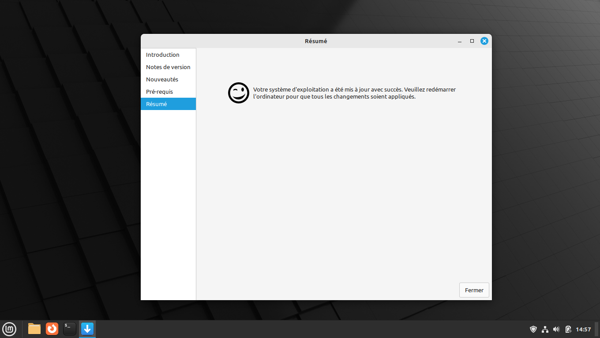

# Guide pour procéder aux mises à niveau sur Linux Mint

Ce guide a pour but de vous expliquer les différentes mises à niveau existantes et comment procéder à leur installation.

## Explication sur les versions de Linux Mint

Linux Mint fournit un numéro de version à chaque sortie d'une nouvelle image. A ce jour, la dernière version en date est la 21.3 :

- 21 correspond à la version majeure. Mint propose une nouvelle version majeure toutes les deux ans.
- .3 signifie que c'est la 3ème version mineure de la 21. Il y a une version mineure tous les 6 environs.

A noter qu'il y a un cycle de 3 versions mineures pour une version majeure. Une nouvelle version mineure ne prolonge pas la vie d'une durée majeure mais apporte quelques nouvelles fonctionnalités et correction de bugs éventuels.

## Faire une mise à niveau vers une nouvelle version mineure

Ces mises à niveau sont les plus simples et peuvent être effectuées entièrement en graphique. **Attenion** : Avant de se lancer dans une mise à niveau, il faut s'assurer d'avoir fait toutes les mises à jour via le gestionnaire de mises à jour, comme indiqué [ici](README.md#3-mise-à-jour-du-système-et-choix-des-miroirs).

Lorsqu'une mise à niveau mineure est disponible, le relevé système vous l'indiquera au travers de cette icône qui apparaitra non loin de l'heure :

En cliquant dessus, vous aurez alors un message similaire à celui ci-dessous :

A noter qu'il est possible d'accéder à la mise à niveau directement via le gestionnaire de mises à jour une fois celle-ci proposée :

Dans les cas, cela vous amènera sur une fenêtre similaire à celle ci-dessous :

A partir de là, il suffit de cliquer sur `Suivant` jusqu'à la page où il est nécessaire de cocher la case "Je comprends les risques et je veux mettre à jour vers xx.y" avant de faire à nouveau `Suivant` pour lancer le téléchargement et l'installation de la mise à niveau. Une fois fait, il suffit de laisser tourner jusqu'à avoir cet écran :

Il suffira alors de redémarrer le PC et cela sera alors terminé !

## Faire une mise à niveau vers une nouvelle version majeure

A compléter quand la version 22 sortira.